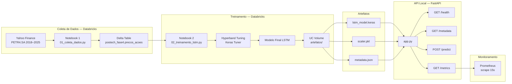

<!-- TITULO DO PROJETO -->

<h1 align="center">Fase 4: Tech Challenge Machine Learning Engineering</h1>
<br />

<!-- SOBRE O PROJETO -->
## Objetivo

Este projeto foi desenvolvido com o objetivo de construir um pipeline ponta a ponta de Machine Learning para **previsão do preço de fechamento da ação PETR4.SA (Petrobras)** utilizando uma rede neural LSTM. O modelo é treinado no Databricks com busca automática de hiperparâmetros e servido por uma API FastAPI local com monitoramento via Prometheus.

### Tecnologias Utilizadas

* [![Databricks][Databricks]][Databricks-url]
* [![TensorFlow][TensorFlow]][TensorFlow-url]
* [![Keras][Keras]][Keras-url]
* [![FastAPI][FastAPI]][FastAPI-url]
* [![scikit-learn][ScikitLearn]][ScikitLearn-url]
* [![Prometheus][Prometheus]][Prometheus-url]
* [![NumPy][NumPy]][NumPy-url]
* [![Uvicorn][Uvicorn]][Uvicorn-url]

Todos os testes foram realizados em ambiente virtual local com uso do Python 3.11.

<!-- ARQUITETURA DO PROJETO -->

## Arquitetura do Projeto



### Resultados do Modelo

| Métrica | Valor | Interpretação |
|---------|-------|---------------|
| **MAE** | R$ 0,52 | Erro absoluto médio por previsão |
| **RMSE** | R$ 0,69 | Penaliza erros maiores |
| **MAPE** | 1,53% | Erro percentual médio |

Hiperparâmetros encontrados pelo Hyperband: `units_1=96`, `units_2=16`, `dropout=0.3`, `learning_rate=0.01`.

<!-- ESTRUTURA DO PROJETO -->
## Estrutura do Projeto

```
tech-challenge-fase4/
├── notebooks/
│   ├── 01_coleta_dados.py        ← coleta PETR4 via yfinance → Delta Table
│   └── 02_treinamento_lstm.py    ← tuning Hyperband + treino LSTM + salva artefatos
└── api/
    ├── app.py                    ← FastAPI + Prometheus
    ├── test_api.py               ← smoke test com dados reais
    ├── requirements.txt
    ├── prometheus.yml            ← config scrape Prometheus
    └── artifacts/                ← baixados do UC Volume
        ├── lstm_model.keras
        ├── scaler.pkl
        └── metadata.json
```

<!-- REPRODUZIR O PROJETO -->
## Reproduzir Localmente

### Parte 1 — Executar os notebooks no Databricks

Execute os notebooks em ordem em uma workspace Databricks ou ambiente Python:

1. **01_coleta_dados** — baixa PETR4 do Yahoo Finance e grava a tabela Delta `postech_fase4.precos_acoes`
2. **02_treinamento_lstm** — tuning Hyperband, treina o LSTM final e salva `lstm_model.keras`, `scaler.pkl` e `metadata.json` no volume UC

### Parte 2 — Baixar os artefatos do volume

Realize o download dos artefatos gerados para criação da API.

### Parte 3 — Rodar a API local

1. Clone o Repositório
   ```sh
   git clone https://github.com/jessycalunna/postech-mleng-fase4.git
   cd postech-mleng-fase4/api
   ```

2. Crie o Ambiente Virtual com Python 3.11
   ```sh
   uv venv --python 3.11
   source .venv/bin/activate
   ```

3. Instale as Dependências
   ```sh
   uv pip install -r requirements.txt
   ```

4. Inicie a API
   ```sh
   python app.py
   ```
   > Acesse em: [http://localhost:8000/docs](http://localhost:8000/docs)

### Parte 4 — Monitoramento com Prometheus (opcional)

```sh
prometheus --config.file=prometheus.yml
```
> Acesse em: [http://localhost:9090](http://localhost:9090)

<!-- ENDPOINTS DA API -->
## Endpoints da API

| Método | Endpoint | Descrição |
|--------|----------|-----------|
| `GET` | `/health` | Verifica o status da API e se o modelo foi carregado |
| `GET` | `/metadata` | Retorna hiperparâmetros, métricas e período de treino do modelo |
| `POST` | `/predict` | Recebe ≥ 60 preços de fechamento e retorna a previsão do próximo dia |
| `GET` | `/metrics` | Métricas no formato Prometheus (latência, contadores, CPU, memória) |
| `GET` | `/docs` | Documentação interativa Swagger UI |

→ Utilize o Swagger UI em [http://localhost:8000/docs](http://localhost:8000/docs) para explorar os endpoints e testar requisições em tempo real.

<!-- EXEMPLOS DE USO -->
## Exemplos de Uso da API

#### URL Base
```
http://localhost:8000
```

#### Verificar o Status da API
* CURL
```bash
curl -X GET "http://localhost:8000/health"
```
* Python
```python
import requests

response = requests.get("http://localhost:8000/health")
print(response.json())
# {"status": "ok", "model_loaded": true}
```

#### Consultar Metadados do Modelo
* CURL
```bash
curl -X GET "http://localhost:8000/metadata"
```
* Python
```python
import requests

response = requests.get("http://localhost:8000/metadata")
print(response.json())
# {"ticker": "PETR4.SA", "window_size": 60, "metrics": {"mape": 1.53, ...}, ...}
```

#### Prever o Próximo Preço de Fechamento
A API utiliza os **últimos 60 valores** da lista fornecida para gerar a previsão. Envie pelo menos 60 preços históricos de fechamento em ordem cronológica.

* CURL
```bash
curl -X POST "http://localhost:8000/predict" \
  -H "Content-Type: application/json" \
  -d '{"prices": [35.1, 35.4, 35.8, 36.0, 35.7, ...]}'
```
* Python
```python
import requests
import yfinance as yf

# busca os últimos 90 dias de PETR4 (mais do que os 60 necessários)
df = yf.download("PETR4.SA", period="90d", auto_adjust=False, progress=False)
prices = df["Close"].dropna().tolist()

response = requests.post(
    "http://localhost:8000/predict",
    json={"prices": prices}
)
print(response.json())
# {"predicted_price": 36.42, "window_size_used": 60, "inference_time_ms": 18.3}
```

#### Consultar Métricas Prometheus
* CURL
```bash
curl -X GET "http://localhost:8000/metrics"
```

💡 Todos os endpoints retornam respostas em formato **JSON**, prontas para uso em **pipelines de dados**, **dashboards** ou **modelos de Machine Learning**.

<!-- METRICAS PROMETHEUS -->
## Métricas de Monitoramento

A API expõe as seguintes métricas no endpoint `/metrics` (formato OpenMetrics/Prometheus):

| Métrica | Tipo | O que mede |
|---------|------|-----------|
| `http_requests_total` | Counter | Total de requisições por método, endpoint e status HTTP |
| `http_request_duration_seconds` | Histogram | Latência HTTP por endpoint |
| `model_inference_duration_seconds` | Histogram | Tempo exclusivo de inferência do modelo |
| `model_predictions_total` | Counter | Total de predições bem-sucedidas |
| `model_prediction_errors_total` | Counter | Total de erros na predição |
| `process_cpu_percent` | Gauge | CPU do processo (%) |
| `process_memory_mb` | Gauge | Memória residente do processo (MB) |

Exemplo de query PromQL para P95 de latência:
```promql
histogram_quantile(0.95, rate(http_request_duration_seconds_bucket[5m]))
```

<!-- AUTORA -->
## Autora

Jessyca Oliveira - jessyca.lunna@gmail.com

Vídeo Apresentação: [Link Google Drive](https://drive.google.com/)

<!-- LINKS E IMAGENS -->
[Databricks]: https://img.shields.io/badge/Databricks-FF3621?style=for-the-badge&logo=databricks&logoColor=white
[Databricks-url]: https://www.databricks.com/
[TensorFlow]: https://img.shields.io/badge/TensorFlow-FF6F00?style=for-the-badge&logo=tensorflow&logoColor=white
[TensorFlow-url]: https://www.tensorflow.org/
[Keras]: https://img.shields.io/badge/Keras-D00000?style=for-the-badge&logo=keras&logoColor=white
[Keras-url]: https://keras.io/
[FastAPI]: https://img.shields.io/badge/FastAPI-009688?style=for-the-badge&logo=fastapi&logoColor=white
[FastAPI-url]: https://fastapi.tiangolo.com/
[ScikitLearn]: https://img.shields.io/badge/scikit--learn-F7931E?style=for-the-badge&logo=scikit-learn&logoColor=white
[ScikitLearn-url]: https://scikit-learn.org/
[Prometheus]: https://img.shields.io/badge/Prometheus-E6522C?style=for-the-badge&logo=prometheus&logoColor=white
[Prometheus-url]: https://prometheus.io/
[NumPy]: https://img.shields.io/badge/NumPy-013243?style=for-the-badge&logo=numpy&logoColor=white
[NumPy-url]: https://numpy.org/
[Uvicorn]: https://img.shields.io/badge/Uvicorn-0C3C26?style=for-the-badge&logo=fastapi&logoColor=white
[Uvicorn-url]: https://www.uvicorn.org/
